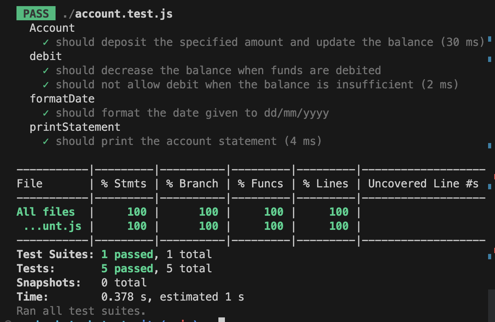

# Account Class

The `Account` class represents a simple bank account that allows for depositing and withdrawing funds. It also provides a method to print the account statement.

## Installation

1. Clone the repository or download the source code.

2. Make sure you have Node.js installed on your machine.

3. Open a terminal and navigate to the project directory.

4. Run the following command to install the required dependencies:

   ```
   npm install
   ```

## Usage

To use the `Account` class, follow these steps:

1. Import the `Account` class in your JavaScript file:

   ```javascript
   const Account = require('./account');
   ```

2. Create a new instance of the `Account` class:

   ```javascript
   const account = new Account();
   ```

3. Perform transactions by depositing or debiting funds:

   ```javascript
   // Deposit funds
   account.deposit(1000, new Date(2023, 0, 10));

   // Withdraw funds
   account.debit(500, new Date(2023, 0, 14));
   ```

4. Print the account statement:

   ```javascript
   account.printStatement();
   ```

## Example

```javascript
// Import the Account class
const Account = require('./account');

// Create a new instance of the Account class
const account = new Account();

// Deposit funds into the account
account.deposit(1000, new Date(2023, 0, 10));
account.deposit(2000, new Date(2023, 0, 13));
account.debit(500, new Date(2023, 0, 14));

// Print the account statement
account.printStatement();
```
Output:
\](outcome.png)](outcome.png)
```
Date || Credit || Debit || Balance
14/01/2023 ||  || 500.00 || 2500.00
13/01/2023 || 2000.00 ||  || 3000.00
10/01/2023 || 1000.00 ||  || 1000.00
```

## Testing

The project includes unit tests for the `Account` class using Jest. To run the tests, execute the following command:

```
npm test
```

The tests cover the deposit and debit functionalities, as well as additional scenarios such as insufficient balance during a debit transaction.
](testCoverage.png)
## License

This project is licensed under the [MIT License].
```
